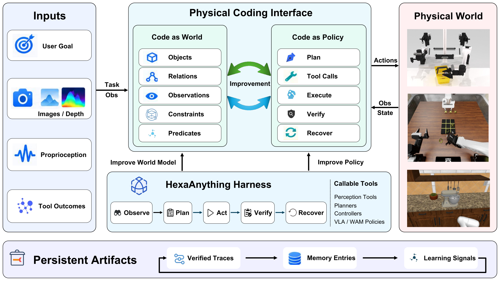
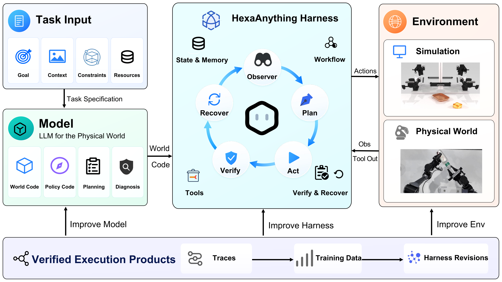
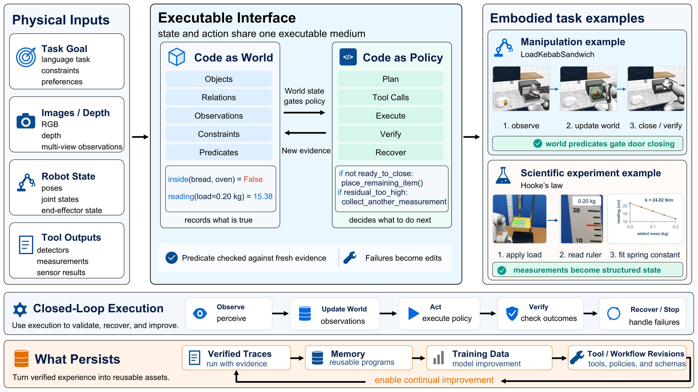
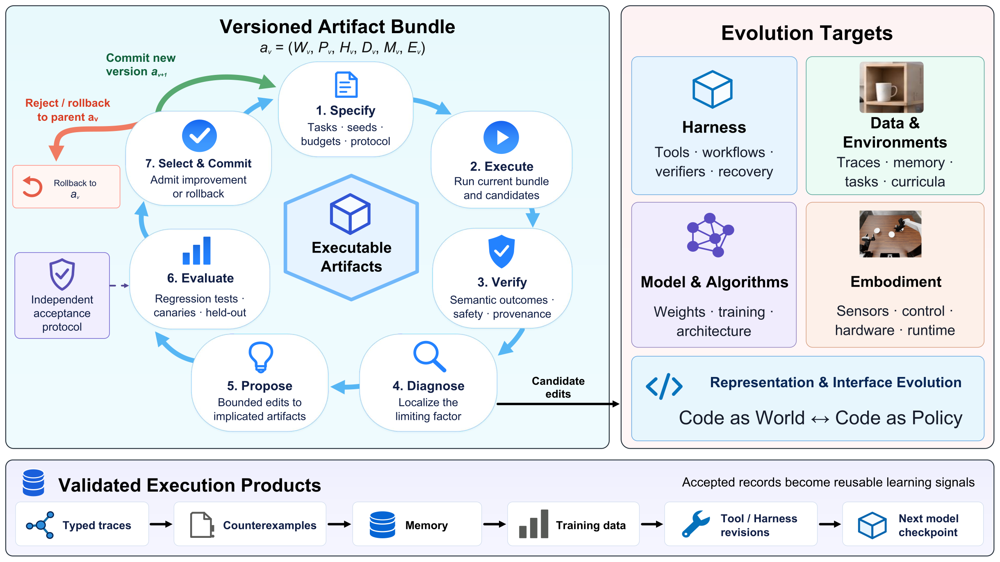

<p align="center">
  <picture>
    <source media="(prefers-color-scheme: dark)" srcset="assets/hexafuture-logo-dark.png">
    <source media="(prefers-color-scheme: light)" srcset="assets/hexafuture-logo-light.png">
    
  </picture>
</p>

<h1 align="center">Physical Coding</h1>

<p align="center">
  <strong>Coding agents for the physical world</strong>
</p>

<p align="center">
  <a href="physical_coding_tech_report.pdf">📄 Report PDF</a> ·
  <a href="https://hexafuture.ai">🌐 Homepage</a> ·
  <a href="https://github.com/HexaFuture/PhysicalCoding">💻 Project</a>
</p>

---

## 📰 News

- **2026-09-29** — Public release of the Physical Coding technical report and
  project page.

## 🧩 Physical Coding

Physical Coding represents task state and execution procedures as editable,
verifiable programs. **HexaAnything** is our physical coding agent: it connects
language models to symbolic world state, robot tools, independent verification,
recovery, and reusable execution traces.

Vision-language-action (VLA) and world-action (WAM) policies usually map an
observation and an instruction directly to an action chunk. Physical Coding
makes the missing state explicit and keeps the execution evidence available for
inspection and revision.

<p align="center">
  
</p>

## 💎 Highlights

- **Code as World** records objects, relations, observations, measurements,
  constraints, and progress predicates.
- **Code as Policy** organizes planning, tool calls, execution, verification,
  branching, and recovery.
- **Independent verification** checks fresh evidence instead of trusting a
  model's completion claim.
- **Persistent evolution** turns validated traces into reusable programs,
  memory, training data, and Harness revisions.
- **One interface, multiple embodiments** spans RoboCasa365, PhyBench, and a
  real AgileX dual-arm robot.

## 🔄 HexaAnything

HexaAnything closes the loop between a model, a Harness, and the environment:
observe the world, update executable state, plan and act through tools, verify
the outcome, then recover or persist the evidence for the next iteration.

<p align="center">
  
</p>

| Component | Role |
| --- | --- |
| Code as World | Objects, relations, observations, constraints, and predicates |
| Code as Policy | Plans, tool calls, control flow, verification, and recovery |
| Harness | State observation, routing, execution, and provenance |
| Persistent artifacts | Verified traces, memory, training data, and revisions |

### Code as World and Code as Policy

The report makes the executable boundary explicit: world state gates policy,
while policy requests new evidence when the current state is insufficient.

<p align="center">
  
</p>

## 📊 Evaluation

### RoboCasa365

Success rates over the report's 50-seed evaluation per split.

| Split | XR-1 (native) | HexaAnything | HexaModel v0.1 |
| --- | ---: | ---: | ---: |
| Atomic-Seen | 78.0% | 80.9% | 81.0% |
| Composite-Seen | 54.8% | 61.5% | 62.3% |
| Composite-Unseen | 34.3% | 38.3% | 39.5% |
| **Overall** | 56.6% | **61.1%** | **61.7%** |

### PhyBench

Mean relative error over valid runs; lower is better.

| Harness + model | Hooke's law | Simple pendulum | Coupled oscillators |
| --- | ---: | ---: | ---: |
| GPT-6-Astra | 2.3% (10/10) | 1.2% (10/10) | **0.8% (10/10)** |
| Opus 5.5 | **1.3% (10/10)** | **1.0% (10/10)** | 1.7% (10/10) |
| GPT-5.6-Sol | 4.8% (9/10) | 1.9% (8/10) | 1.2% (10/10) |

On the AgileX dual-arm platform, the same interface completed all three trials
for five of seven tabletop tasks; the remaining two tasks were partially
successful and produced recoverable execution evidence.

<p align="center">
  
</p>

## 📚 Citation

```bibtex
@misc{gao2026selfevolvingcodingagentsdigital,
      title={Self-Evolving Coding Agents: From Digital Programs to Physical-World Intelligence}, 
      author={Hongcheng Gao and Jingjing Zhou and Zelin Zheng and Shijia Ge and Jay Zhu and Yazhe Wang and Jianshu Zeng and Xuan Shangguan and Di Wu and Lingyu He and Zhiqi Jia and Sihang Wu and Xiao He},
      year={2026},
      eprint={2609.35432},
      archivePrefix={arXiv},
      primaryClass={cs.RO},
      url={https://arxiv.org/abs/2609.35432}, 
}
```

## License

The report and visual assets are provided for research communication. Add the
project's final license here before public redistribution of any code, data, or
model artifacts.
